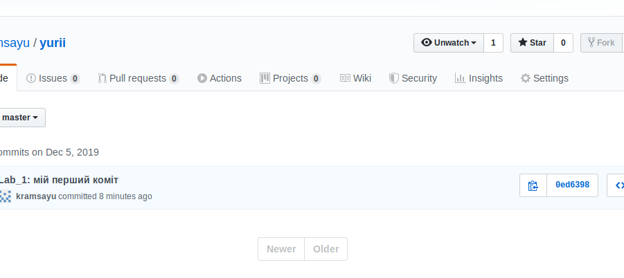
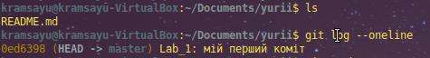
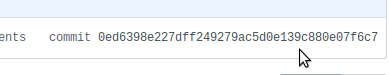
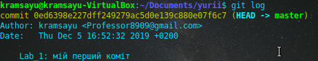

# Lab_1: Здобуття навиків роботи з системою версіонування коду GitHub.

1. Виконав клонування репозиторію на локальний ПК командою `git clone *посилання_репозиторію*`.
2. Перший коміт був здійснений під хешем `0ed6398e227dff249279ac5d0e139c880e07f6c7`. Попередніх хешів немає, так як це самий перший коміт. Перевірив зміни через веб-версію: все співпадає:
- 
- 
- 
- 
3. Створив відгалудження з назвою `kvadrokpter` перейшов на новостворену гілку. Вношу якраз зміни у цю гілку. Для створення гілки використав команду `git branch kvadrokopter`, для того, щоб переключитись на гілку `git checkout kvadrokopter`. Зробив коміт зі змінами
