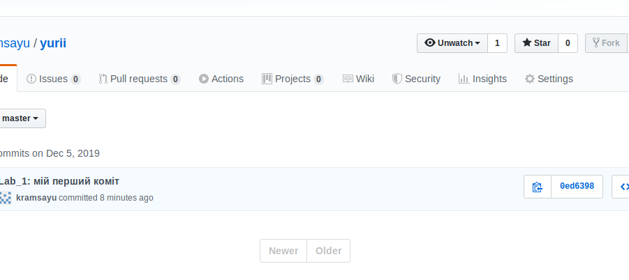
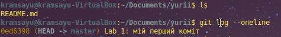
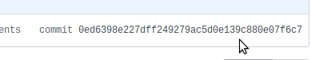
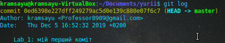

# Lab_1: Здобуття навиків роботи з системою версіонування коду GitHub.

1. Виконав клонування репозиторію на локальний ПК командою `git clone *посилання_репозиторію*`.
2. Перший коміт був здійснений під хешем `0ed6398e227dff249279ac5d0e139c880e07f6c7`. Попередніх хешів немає, так як це самий перший коміт. Перевірив зміни через веб-версію: все співпадає:
- 
- 
- 
- 
3. Створив відгалудження з назвою `kvadrokpter` перейшов на новостворену гілку. Вношу якраз зміни у цю гілку. Для створення гілки використав команду `git branch kvadrokopter`, для того, щоб переключитись на гілку `git checkout kvadrokopter`. Зробив коміт зі змінами
4. перейшов на гілку `master` - зміни зроблені в гілці `kvadrokopter` відсутні на гілці `master`. Це зумовлено тим, що кожна гілка призначеня для того щоб працювати з нею окремо від інших гілок. Гілка - це відгалудження від головної гілки, яке має вже свою копію файлів і працює з ними окремо.
5. Створив pull request на злиття гілок. Вирішив конфлікти відредагувавши README.
6. Конфлікт виник через не відповідність вмісту файлу README.md на головній (master) та сусідній (kvadrokopter) гілках. Вирішено редагуванням файлу вручну. 
7. створив папку з назвою лабораторної `lab_1` та перемітив туди файли. Все відображається у веб-версії