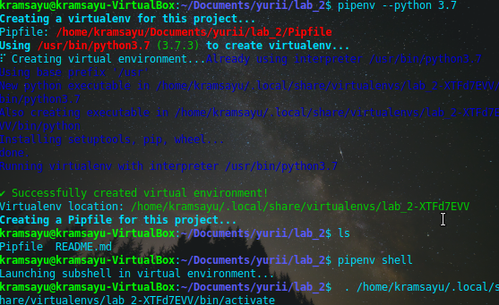

# Lab_2: Автоматизація. Знайомство з CI/CD.

## Pre-requirements:
- віртуальна машина на основі Ubuntu 18.04;
- встановлено програми git, make, Python 3.7, PIP;

## Хід роботи
1. Створив папку lab_2 з README-файлом.
2. Встановив `pipenv` та створив середовище для Python. Ознайомився з командою `pipenv -h`

3. Встановив необхідні бібліотеки (`requests`, `ntplib`):

4. Створив файл `app.py`, скопіював код з репозиторію.
5. Перевірив чи програма працює:

6. Встановив бібліотеку `pytest`:

7. Запустив тести:

8. (Захист) - Дописав у програмі функцію для перевірки часу доби (AM/PM) та друкування фрази - "Доброго дня!"/"Доброї ночі":
- 
- 
9. Написав тести, що перевіряють правильність виконання програми, а також доповнив програму:
- Програма: 
- Тести: 
- Запуск: 
10. Вивів результат виконання тестів та програми у файл використовуючи оператор спрямування стандартних потоків: `>` - з перезаписом, `>>` - з дописом в кінець файлу. В обох випадках, якщо файл не існує - його буде створено. :

11. Зробив коміт зі змінами