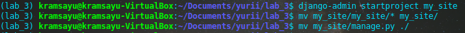
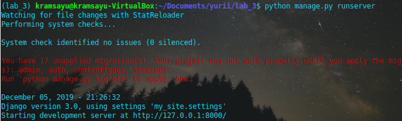

# Lab_3: Вступ до моніторингу.

## Pre-requirements:
- середовище з інстальованим Python / pip / pipenv;
- будь-який WEB-браузер;

## хід роботи
1. Створено папку з назвою лабораторної (lab_3). Ініціалізовано середовище pipenv. Встановлено необхідні пакети (django)
2. Створено django-template з назвою `my_site`. Винесено файли на рівень вище.
- 
3. Запустив сервер django:
- 
4. створив коміт з базовим темплейтом. Файл `db.sqlite3` не комітив додавши його до `.gitignore`.