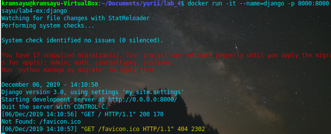
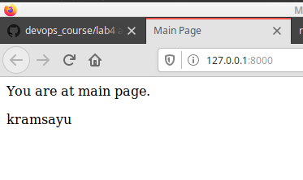

# Lab_4: Робота з Docker

## Pre-requirements:
- віртуальна машина (Ubuntu) з інстальованим Docker;

## Хід роботи
1. Прочитав документацію docker
2. Перенаправив вивід команди `(docker -v && docker -h && docker run docker/whalesay cowsay Docker is fun) > my_work.log` у файл `my_work.log`
3. Ознайомився з документацією Dockerfile.
4. завантажив базовий image з репозиторію. Створив `Dockerfile` та скопіював туди вміст. Змінив посилання на власне та зробив коміт.
5. Створив репозиторій на DockerHub - https://hub.docker.com/r/kramsayu/lab4-ex
6. Виконав білд та завантажив image на репозиторій dockerhub.
7. Запустив веб-сайт в контейнері:
- 
- 
8. Створюю ще один контейнер:
- створюю Dockerfile - `Dockerfile.monitoring`, редагую для програми моніторингу
- виконую build з Dockerfile та отримую новий image з тегом `kramsayu/lab4-ex:monitoring`.
- запускаю два контейнери одночасно. Використав ключ `--net=host` для відкриття доступу до мережі хоста в програмі моніторингу
- Витягнув логи з контейнеру `monitoring`:
   - створив нове сховище (volume): `docker volume create krams`
   - запустив контейнер-моніторинг та прикріпив до нього сховище: `docker run -it --rm --name=monitoring --net=host -v krams:/app kramsayu/lab4-ex:monitoring`, де `/app` - шлях в середині контейнеру який потрібно додати в сховище.
   - витягнув файл логів командою: `docker cp monitoring:/app/server.log ./`