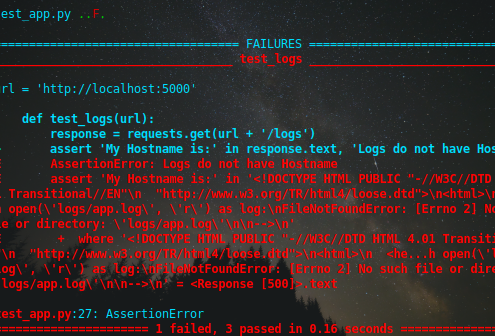
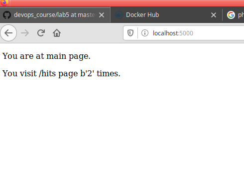
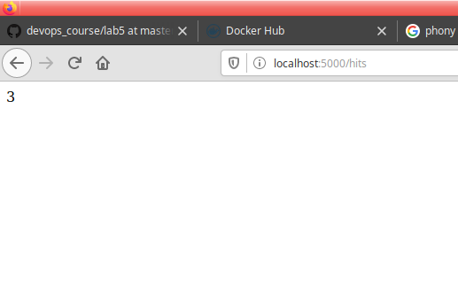
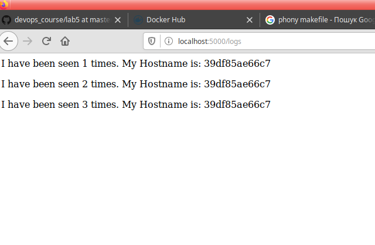

## Lab_5: Автоматизація за допомогою Makefile VS Docker Compose

### Pre-requirements:
- віртуальна машина (Ubuntu) з інстальованим Docker / docker-compose, make;

### Хід роботи.
1. Прочитав про `docker-compose` за [посиланням](https://docs.docker.com/compose/);
2. Коли необхідно створити простий веб сайт на Python найчастіше використовують бібліотеку `Flask`. Прочитав про неї за [посиланням](https://flask-russian-docs.readthedocs.io/ru/latest/quickstart.html); 
3. Наше завдання: за допомогою Docker автоматизувати розгортання веб сайту з усіма супутніми процесами. Це зробимо двома шляхами:
    - за допомогою `Makefile`;
    - за допомогою `docker-compose.yaml`;
4. Першим розглянемо варіант з `Makefile`, але для цього створимо робочий проект. 
5. Створив папку `my_app`. Створив папку `tests`, де будуть тести на перевірку працездатності мого проекту. Скопіював файли з цього репозиторію у відповідні папки свого. Ознайомився із вмістом кожного з файлів. Файл `requirements.txt` у папці проекту та тестах буде мітити залежності для нашого проекту (flask, redis, requests).
6. Cпробував чи проект є працездатним перейшовши у папку та після ініціалізації середовища виконав команди записані нижче:
    ```bash
    pipenv --python 3.7
    pipenv install -r requirements.txt
    pipenv run python app.py
    ```
    - так само ініціалузував середовище для тестів у іншій вкладці шелу та запустив їх командою (тести не пройшли успішно, один тест зазнав невдачі):
    ```bash
    pipenv run pytest test_app.py --url http://localhost:5000
    ```
    - 
    - автоматично створені файли `Pipfile` та `Pipfile.lock`, а також папку `.venv` видалив після зупинки проекту.
    - перевірив роботу сайту перейшовши на кожну із сторінок (знайдете їх в програмі `app.py` - `/hits`, `logs`):
7. _Видалив файли які постворювались після тестового запуску_. Створив два `Dockerfile` з іменами як у цьому репозиторію та `Makefile`;
8. Ознайомився із вмістом `Dockerfile` та `Makefile` та його директивами. Що робить кожна директива `Makefile`:
- `STATES := app tests` - змінна яка зберігає цілі для створення імеджів серверу та тестів
- `REPO := ...` - змінна містить назву репозиторію DockerHub
- `.PHONY: $(STATES)` - по замовчуванню утиліта make розцінює _цілі_ як назви файлів, такий підхід дозволяє уникати конфліктів назв та імен, а також пришвидшити виконяння.
- `$(STATES):...` - використовується як назва цілі (сюди входять дві цілі: app та tests), містить певний набір інструкцій для досягнення цілі, в даному випадку: створення образу контейнера для app та tests
- `run: ...` - ціль для запуску контейнеру з сервером та створення мереж
- `test-app:..` - запуск контейнера з тестами
- `docker-prune:...` - очистка ресурсів docker
9. Використовуючи команду `make` створив Docker імеджі для додатку та для тестів, відредагував теги на свої. Запустив додаток та перейшовши в іншу вкладку шелу запустив тести. Перевірив роботу веб-сайту. Зробіть скріни сторінок:
- 
- 
- 
10. Зупинив проект натиснувши `Ctrl+C` та почистив всі ресурси Docker за допомогою `make docker-prune`.
11. Створив директиву в `Makefile` для завантаження створених імеджів у свій Docker Hub репозиторій: `make repo-upload`. Завантажив імеджі до свого репозиторію;
12. Видаліть створені та закачані імеджі. Команда `docker images` виводить пусті рядки. Створив директиву в `Makefile` яка автоматизує процес видалення Ваших імеджів: `make image-prune`.
13. Перейдемо до іншого варіанту з використанням `docker-compose.yaml`. Для цього створив даний файл у кореневій папці проекту та заповнив вмістом з прикладу. Дві мережі потрібні для ізоляції мереж певних контейнерів, тобто певні контейнери будуть працювати в одній мережі, а інші відповідно в іншій і, таким чином, одні не будуть мати доступу до інших;
14. Запустив `docker-compose`;
    ```bash
    docker-compose version
    docker-compose -p lab5 up
    ```
15. Веб-сайт працює. Адреса на яку необхідно перейти - `localhost` (127.0.0.1)
16. Докер створив імеджі. Імеджі мають теги: `bobas/lab4-examples:compose-app` та `bobas/lab4-examples:compose-tests`. Змінив їх на власний репозиторій і перезапустив `docker-compose`.
17. Зупинив проект натиснувши `Ctrl+C` і почистив ресурси створені компоуз `docker-compose down`;
18. Завантажив створені імеджі до Docker Hub репозиторію за допомого команди:
    ```bash
    docker-compose push
    ```
19. На мою думку краще використовувати `Makefile`: він дозволяє більш гнучко організовувати процес автоматизації. Ідеальний варіант - це комбінація обох варіантів. При роботі тільки з контейнерами краще використовувати docker-compose, але якщо необхідно автоматизовувати інші процеси, то оптимальним буде використання Makefile.
20. (Завдання) - створив `docker-compose.yaml` для лабораторної №4 (файл знах. в папці з лабораторною).
21. Відредагував _README.md_ та виконав коміт.