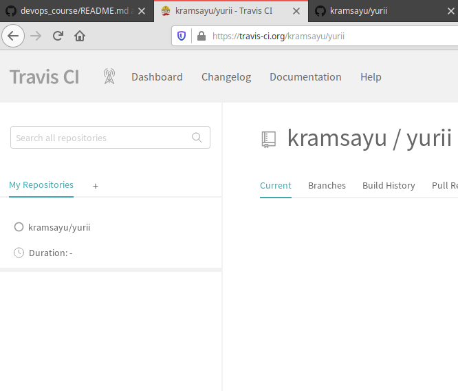

## Lab_6: Автоматизація за допомогою CI/CD серверів.

### Pre-requirements:   
- аккаунт GitHub;
- зареєструвався на сайті [Travis](https://travis-ci.org)

### What to do.
1. Переглянув [стартову сторінку](https://docs.travis-ci.com/user/tutorial/). 
2. Звернувся до документації на [сторінці](https://docs.travis-ci.com/user/for-beginners/).
3. Додав репозиторій до Travis.
 
4. Створив у своєму GitHub репозиторію `.travis.yaml` файл та скопіював туди вміст.
5. Прочитав [документацію](https://docs.travis-ci.com/user/docker/#pushing-a-docker-image-to-a-registry)
5. (**Завдання**):
    - переписав білд _lab 2_ з використання кроків записаних у Makefile;
    - переписав білд _lab 4_ де створив ще один DockerFile для контейнера моніторингу;
    - переписав білд _lab 5_ і додав кроки Makefile які роблять push імеджів у Docker Hub репозиторій;
    - [Посилання на Travis білд](https://travis-ci.org/kramsayu/yurii)
6. Після успішного виконання роботи відредагував персональний _README.md_ у цьому репозиторію та створив pull request.